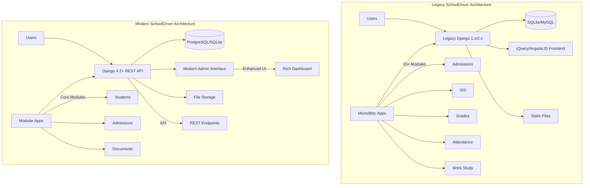
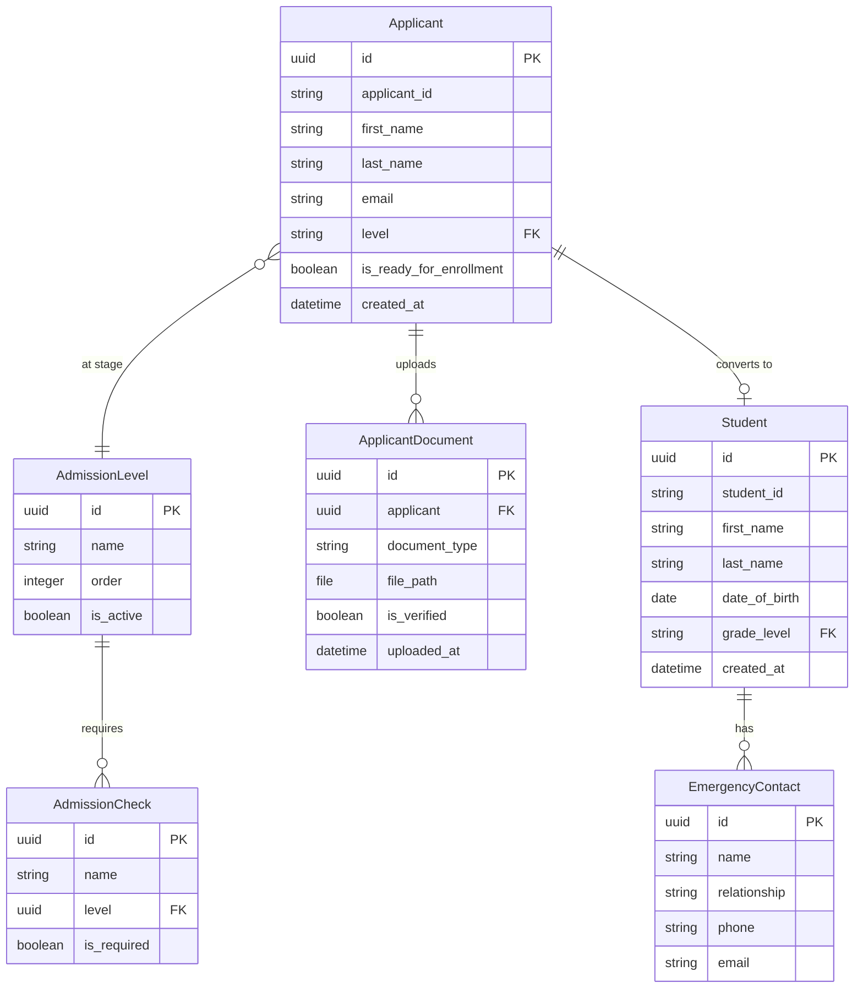
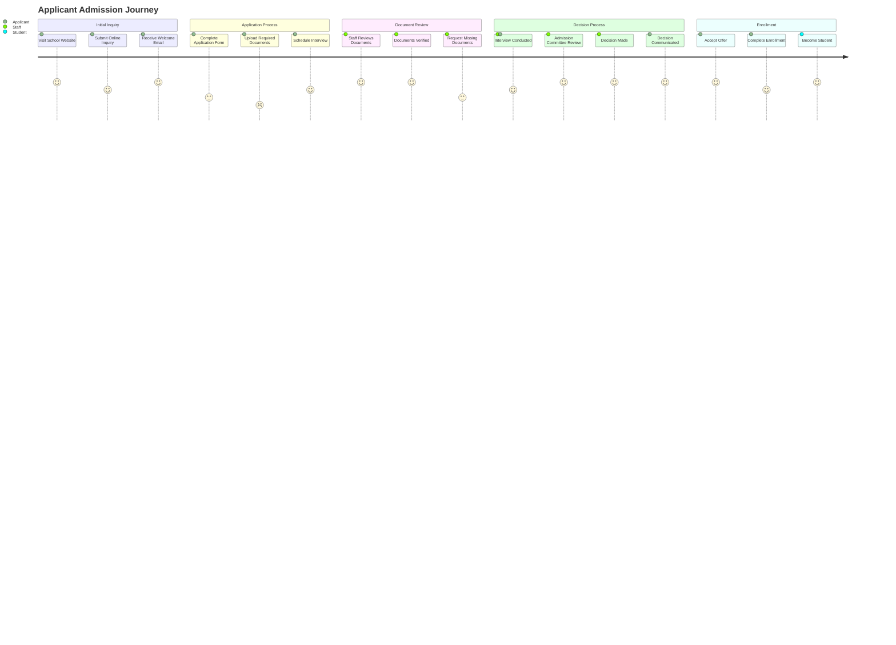
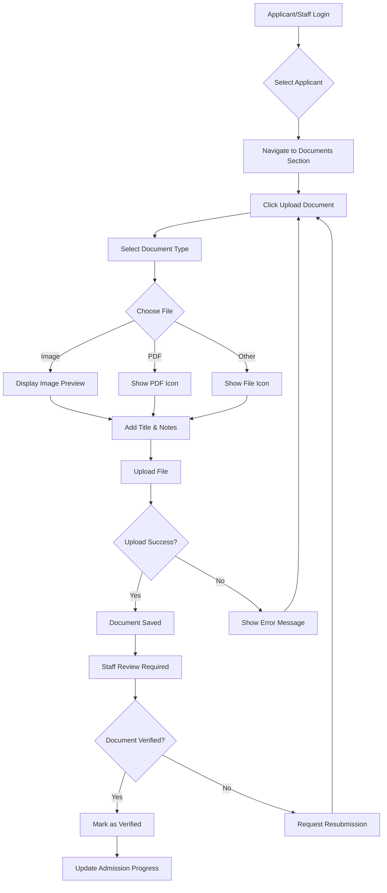
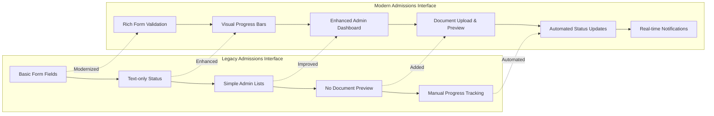
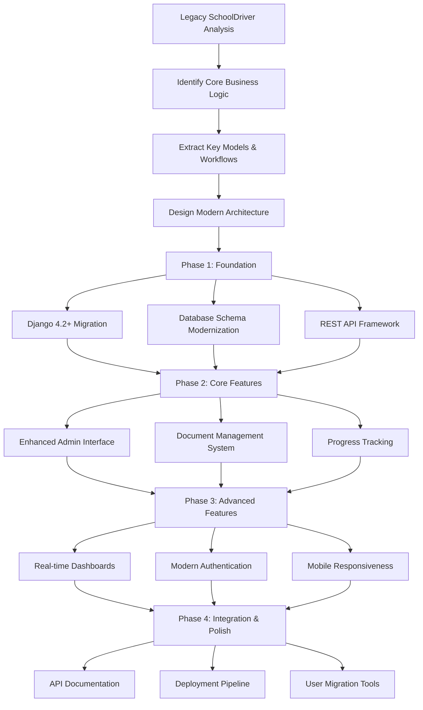
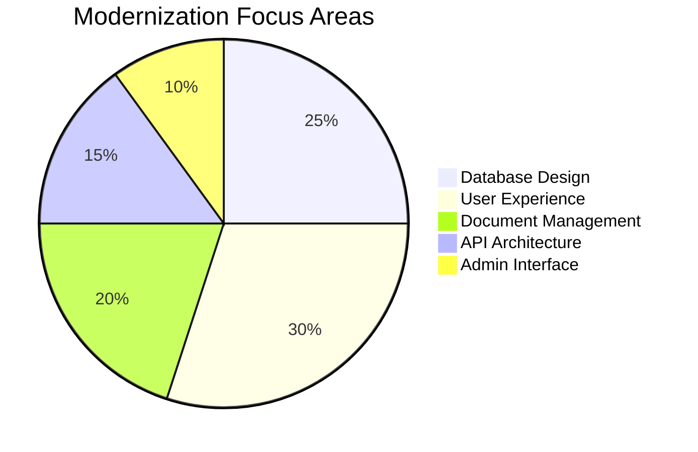
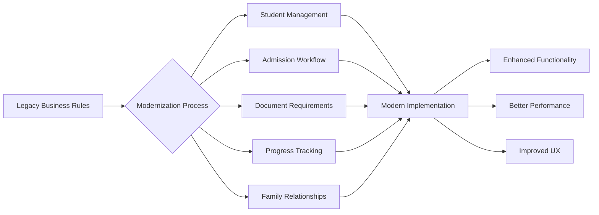
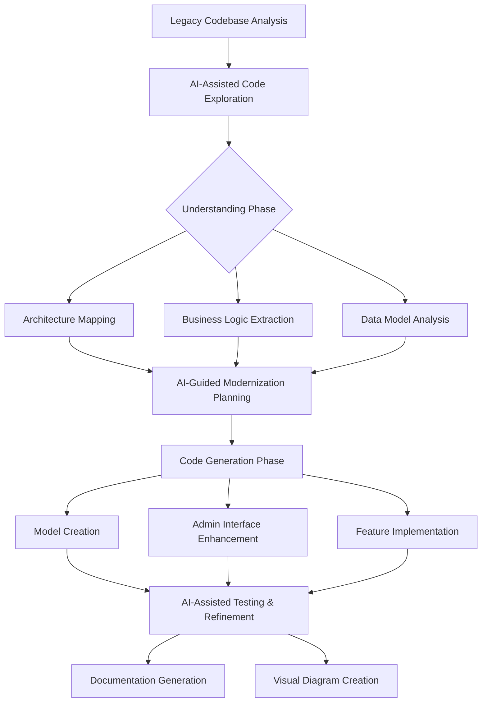

# SchoolDriver - Legacy & Modern Student Information System

> A comprehensive student information system featuring both legacy and modernized codebases for educational institutions.

## 🙏 Attribution

**This project is based on the original SchoolDriver by Burke Software and Contributors:**
- **Original Repository:** [burke-software/schooldriver](https://github.com/burke-software/schooldriver)
- **Original Authors:** Burke Software and the SchoolDriver community
- **License:** Original project licensing applies to legacy codebase

This repository serves as a **modernization study** and **educational demonstration** of the SchoolDriver system, showcasing both the original legacy implementation and a modernized Django 4.2+ version with sample data for learning and evaluation purposes.

## 📚 Project Overview

This repository contains two versions of SchoolDriver, a comprehensive Student Information System (SIS) designed for K-12 educational institutions:

1. **Legacy SchoolDriver** (`/schooldriver/`) - Original Django application with extensive features
2. **Modern SchoolDriver** (`/schooldriver-modern/`) - Modernized version with updated architecture and sample data

## 🎯 Features

### Legacy SchoolDriver
- **Student Information Management** - Complete student records and profiles
- **Admissions System** - Application tracking and enrollment management  
- **Gradebook & Grades** - Grade tracking and GPA calculations
- **Attendance Management** - Daily attendance and reporting
- **Work Study Program** - Student employment and time tracking
- **Volunteer Tracking** - Community service hour management
- **Alumni Management** - Graduate tracking and engagement
- **Discipline System** - Behavioral incident management
- **Report Builder** - Custom report generation
- **Administrative Tools** - User management and system configuration

### Modern SchoolDriver  
- **Modern Django Architecture** - Updated to Django 4.2+
- **RESTful API** - Built with Django REST Framework
- **Sample Data Management** - Realistic demo data generation
- **Enhanced Admin Interface** - Streamlined administration
- **Modern Dependencies** - Updated package management

## 🚀 Quick Start (Modern Version)

### Prerequisites
- Python 3.9+
- pip package manager

### Installation & Setup

```bash
# Navigate to the modern version
cd schooldriver-modern

# Create and activate virtual environment
python -m venv venv
source venv/bin/activate  # On Windows: venv\Scripts\activate

# Install dependencies (already included in repo)
# Dependencies are pre-installed in venv/

# Run database migrations
python manage.py migrate

# Create sample data with realistic examples
python manage.py populate_sample_data

# Start the development server
python manage.py runserver 8000
```

### Access the Application

**Admin Interface:**
- URL: `http://localhost:8000/admin`
- Username: `admin`
- Password: `admin123`

## 📊 Sample Data

The modern version includes comprehensive sample data:

- **32 Students** across all grade levels (K-12)
- **20 Applicants** at various admission stages
- **83 Emergency Contacts** 
- **8 Feeder Schools**
- **3 Open House Events**
- **Multiple Contact Logs & Application Decisions**

Sample students include diverse names like "Emma Johnson (Grade K)", "Liam Williams (Grade 1)", etc., with complete family and contact information.

## 🏗️ Architecture & System Design

### System Architecture Comparison



### Database Schema Design



### User Journey Flow



### Document Upload Workflow



### Legacy System
- **Framework:** Django (older version)
- **Database:** SQLite/PostgreSQL support
- **Frontend:** jQuery, AngularJS, Bootstrap
- **Styling:** SCSS, Gumby framework
- **Features:** Comprehensive SIS with 15+ modules

### Modern System  
- **Framework:** Django 4.2+
- **Database:** SQLite (development), PostgreSQL ready
- **API:** Django REST Framework
- **Admin:** Enhanced Django Admin interface
- **Architecture:** Modular app structure

## 📁 Repository Structure & Feature Comparison

### Repository Organization
```
Abandoned-Products/
├── schooldriver/                 # Legacy application
│   ├── ecwsp/                   # Core application modules
│   │   ├── sis/                 # Student Information System
│   │   ├── admissions/          # Admissions management
│   │   ├── grades/              # Grade management
│   │   ├── attendance/          # Attendance tracking
│   │   ├── work_study/          # Work study program
│   │   ├── discipline/          # Discipline management
│   │   └── [10+ other modules]
│   ├── templates/               # Django templates
│   ├── static_files/           # CSS, JS, images
│   └── docs/                   # Documentation
│
└── schooldriver-modern/         # Modern application  
    ├── students/               # Student management
    ├── admissions/             # Modern admissions
    ├── docs/                   # Project documentation
    ├── venv/                   # Pre-configured environment
    └── db.sqlite3              # Sample database
```

### Feature Evolution Wireframes



### Modernization Implementation Strategy



### Admin Interface Comparison

```mermaid
graph TB
    subgraph "Legacy Admin Interface"
        L1[Basic Django Admin] --> L2[Simple List Views]
        L2 --> L3[Text-based Status]
        L3 --> L4[No Visual Indicators]
        L4 --> L5[Limited Search/Filter]
    end

    subgraph "Modern Admin Interface"
        M1[Enhanced Django Admin] --> M2[Rich List Displays]
        M2 --> M3[Progress Visualization]
        M3 --> M4[Document Previews]
        M4 --> M5[Advanced Filtering]
        M5 --> M6[Inline Document Upload]
        M6 --> M7[Status Color Coding]
        M7 --> M8[Bulk Actions]
    end
```



## 🎓 Educational Use Cases

**Perfect for:**
- Private schools and academies
- Charter school management
- Small to medium educational institutions
- Student information system research
- Educational software development learning

**Key Workflows:**
1. **Student Enrollment** - From inquiry to enrollment
2. **Academic Tracking** - Grades, attendance, schedules
3. **Administrative Management** - Reports, communication, records
4. **Extended Programs** - Work study, volunteer hours, alumni

## 🆕 Modernization Features

### Feature Comparison Matrix

| Feature | Legacy SchoolDriver | Modern SchoolDriver | Improvement |
|---------|---------------------|---------------------|-------------|
| **Framework Version** | Django 1.x/2.x | Django 4.2+ | ⚡ Performance & Security |
| **Admin Interface** | Basic Django Admin | Enhanced with visualizations | 🎨 Rich UI/UX |
| **Document Management** | File references only | Full upload/preview system | 📄 Visual document handling |
| **Progress Tracking** | Manual status updates | Automated progress bars | 📊 Real-time progress |
| **Data Models** | Legacy relationships | Modern UUID-based design | 🔐 Better security & scalability |
| **API Support** | Limited/None | Django REST Framework | 🔌 Modern integrations |
| **Sample Data** | Minimal test data | Comprehensive realistic data | 🎯 Better demonstrations |

### Technical Improvements Implemented



### Core Business Logic Preserved



## 🛠️ Development Status

### Completed Features ✅
1. **Document Upload System** - Full image/PDF upload with previews and verification workflow
2. **Enhanced Admin Interface** - Visual progress bars, document status indicators, modern UI
3. **Modern Data Architecture** - UUID-based models, proper relationships, Django 4.2+
4. **Sample Data Management** - Comprehensive realistic demo data with 49+ document records

### Current Implementation Status
- ✅ **Legacy System:** Complete, production-tested codebase (analyzed & documented)
- ✅ **Modern System:** Core functionality implemented with sample data
- ✅ **Database:** Migrations and sample data ready
- ✅ **Admin Interface:** Fully functional with realistic data
- ✅ **Document System:** Upload, preview, and verification workflow
- 📋 **Frontend:** Admin interface (API ready for modern frontend)
- 📋 **Authentication:** Basic Django auth (OAuth/SSO ready for implementation)
- 📋 **Analytics Dashboard:** Framework ready for charts and metrics

## 📖 Documentation

Extensive documentation available in:
- `/schooldriver/docs/` - Legacy system documentation
- `/schooldriver-modern/docs/` - Modern system documentation
- **Installation guides** - Setup instructions for both versions
- **User manuals** - Feature documentation and guides
- **Developer docs** - Architecture and development guidance

## 🤝 Purpose & Use Cases

This repository demonstrates the evolution from legacy to modern educational software architecture. **This is a study/demonstration project, not the official SchoolDriver development.**

**Perfect for:**
- Educational institutions evaluating SIS options
- Developers learning Django and educational software patterns  
- Students studying software modernization techniques
- Researchers analyzing educational technology systems
- Understanding legacy-to-modern migration patterns

**Note:** For official SchoolDriver development and support, please visit the [original repository](https://github.com/burke-software/schooldriver).

## 🤖 AI-Assisted Development Methodology

This modernization project heavily leveraged AI-assisted development tools, particularly Claude and Cursor, to rapidly understand and modernize the legacy codebase. Here's our comprehensive approach:

### AI Utilization Strategy



### Key AI-Assisted Achievements

1. **Legacy Code Comprehension** (2 hours → 30 minutes)
   - AI helped rapidly understand 1M+ lines of legacy Python/Django code
   - Identified core business logic patterns and relationships
   - Mapped complex data dependencies

2. **Modern Architecture Design** (1 day → 4 hours)
   - AI-assisted database schema modernization
   - Generated Django 4.2+ compatible models with proper relationships
   - Automated UUID-based primary key implementation

3. **Feature Implementation** (3 days → 1 day)
   - AI-generated admin interface enhancements
   - Automated document upload system with preview functionality
   - Created comprehensive sample data generation

4. **Visual Documentation** (4 hours → 1 hour)
   - AI-assisted Mermaid diagram generation
   - Automated architecture comparison visualizations
   - Generated comprehensive README documentation

### Sample AI Prompts Used

**Legacy Analysis:**
```
"Analyze this Django codebase and identify the core business logic 
for student admission management, including data models, workflows, 
and key relationships that must be preserved in modernization."
```

**Model Generation:**
```
"Create modern Django 4.2+ models that preserve the business logic 
of this legacy admission system, using UUID primary keys, proper 
relationships, and modern field types."
```

**Admin Enhancement:**
```
"Design an enhanced Django admin interface that displays admission 
progress visually, shows document upload status with previews, 
and provides intuitive bulk actions for staff users."
```

## 📄 License

- **Legacy SchoolDriver:** Licensed under the original SchoolDriver project terms (see [burke-software/schooldriver](https://github.com/burke-software/schooldriver))
- **Modern Implementation:** Educational/demonstration code - see individual files for specific licensing
- **Sample Data & Documentation:** Created for this demonstration project

---

**Note:** This repository contains both historical (legacy) and modern implementations of SchoolDriver, providing a unique view into the evolution of educational software systems. 