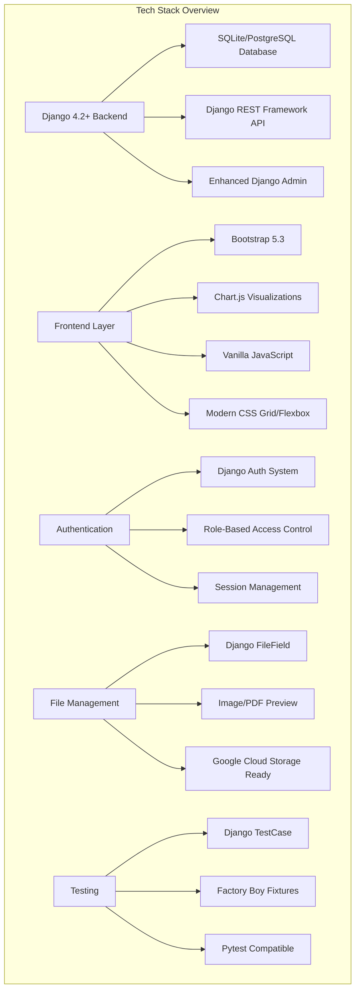

# SchoolDriver Modern - Technology Stack

## Architecture Overview

## Backend Technologies

### **Core Framework**
- **Django 4.2+**: Modern Python web framework with latest security and performance features
- **Django REST Framework**: RESTful API development with serializers and viewsets
- **Python 3.9+**: Latest Python features and performance improvements

### **Database Layer**
- **SQLite**: Development database with full feature support
- **PostgreSQL**: Production-ready with advanced query capabilities
- **Django ORM**: Database abstraction with UUID primary keys

### **API & Integration**
- **Django REST Framework**: Full REST API with authentication
- **JSON API**: Standardized API responses
- **CORS Support**: Cross-origin resource sharing ready

## Frontend Technologies

### **UI Framework**
- **Bootstrap 5.3**: Modern responsive CSS framework
- **Font Awesome**: Icon library for consistent UI elements
- **Custom SCSS**: Modular styling with variables and mixins

### **JavaScript & Interactivity**
- **Vanilla JavaScript**: No heavy frameworks, better performance
- **Chart.js**: Interactive charts and data visualizations
- **Modern ES6+**: Arrow functions, async/await, modules

### **Layout & Design**
- **CSS Grid**: Advanced layout systems
- **Flexbox**: Responsive component layouts
- **Mobile-First**: Responsive design principles

## Authentication & Security

### **User Management**
- **Django Authentication**: Built-in user system with extensions
- **Role-Based Access Control**: Student, Parent, Staff, Admin roles
- **Session Management**: Secure login/logout with remember me

### **Security Features**
- **CSRF Protection**: Cross-site request forgery prevention
- **SQL Injection Protection**: Django ORM safe queries
- **XSS Prevention**: Template auto-escaping
- **Secure Headers**: Security middleware implementation

## File Management & Storage

### **Document Handling**
- **Django FileField**: Secure file upload handling
- **Image/PDF Preview**: Browser-based document preview
- **File Validation**: Type checking and size limits

### **Storage Options**
- **Local Storage**: Development file serving
- **Google Cloud Storage**: Production-ready cloud storage
- **CDN Ready**: Static file serving optimization

## Development & Testing

### **Code Quality**
- **Ruff**: Fast Python linter replacing flake8, isort, etc.
- **Black**: Code formatting for consistent style
- **mypy**: Static type checking for better code quality

### **Testing Framework**
- **Django TestCase**: Built-in testing with database isolation
- **Factory Boy**: Test data generation with realistic fixtures
- **Pytest**: Advanced testing features and plugins
- **Coverage.py**: Code coverage reporting

### **Development Tools**
- **Django Debug Toolbar**: Development debugging and profiling
- **Django Extensions**: Additional management commands
- **Auto-reload**: Development server with hot reloading

## Deployment & Infrastructure

### **Containerization**
- **Docker**: Containerized application deployment
- **Multi-stage builds**: Optimized production containers
- **Health checks**: Container monitoring and restart policies

### **Cloud Deployment**
- **Google Cloud Run**: Serverless container hosting
- **Firebase Hosting**: Static file serving and CDN
- **Google Cloud Storage**: Media file storage
- **Cloud SQL**: Managed PostgreSQL database

### **CI/CD Pipeline**
- **GitHub Actions**: Automated testing and deployment
- **Automated Testing**: Run tests on every commit
- **Security Scanning**: Dependency vulnerability checks
- **Performance Monitoring**: Application performance insights

## Data Architecture

### **Database Design**
- **UUID Primary Keys**: Better security and scalability
- **Normalized Relations**: Efficient data structure
- **Indexes**: Optimized query performance
- **Migrations**: Version-controlled schema changes

### **Sample Data**
- **Realistic Test Data**: 32 students, 20 applicants, 83 contacts
- **Management Commands**: Automated data population
- **Data Factories**: Consistent test data generation
- **Seed Scripts**: Development environment setup

## Performance & Optimization

### **Backend Optimization**
- **Query Optimization**: Efficient database queries with select_related
- **Caching**: Django's caching framework ready
- **Static Files**: Compressed and versioned assets
- **Database Indexing**: Optimized query performance

### **Frontend Performance**
- **Minified Assets**: Compressed CSS and JavaScript
- **Image Optimization**: Responsive images and lazy loading
- **CDN Ready**: Static asset distribution
- **Progressive Enhancement**: Core functionality without JavaScript

## Monitoring & Analytics

### **Application Monitoring**
- **Django Logging**: Comprehensive error and access logging
- **Performance Metrics**: Response time and query monitoring
- **Error Tracking**: Automated error reporting and alerting

### **Business Analytics**
- **Admin Dashboard**: Real-time charts and statistics
- **Data Export**: CSV download for reporting
- **Custom Reports**: Flexible data analysis tools
- **Usage Analytics**: User engagement tracking

## Documentation & Maintenance

### **Code Documentation**
- **Docstrings**: Comprehensive function and class documentation
- **Type Hints**: Static typing for better code understanding
- **README Files**: Setup and usage instructions
- **API Documentation**: REST endpoint documentation

### **Project Documentation**
- **Architecture Diagrams**: Visual system overview
- **User Guides**: Feature documentation for end users
- **Developer Guides**: Setup and contribution guidelines
- **Deployment Guides**: Production deployment instructions
