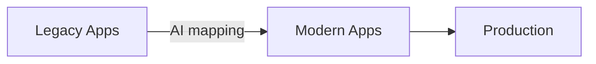

# 🧠 Brain-Lift Log

> “Brain-lift” = the process of rapidly absorbing a legacy codebase and then elevating it with AI-assisted tooling.

This log summarises how artificial-intelligence workflows were used to understand *SchoolDriver Modern*, migrate features, and accelerate development.

---

## 1. Discovery & Comprehension

| Step | AI Method | Outcome |
|------|-----------|---------|
| 📂 Codebase Scan | *Semantic search* → “How does authentication work?” | Isolated legacy auth flow & permissions |
| 🔍 Model Mapping | *GPT-4* prompt: “Generate UML from these Django models” | Visual map of 50+ models with relations |
| ⚙️ Dependency Audit | *LLM chain* + `pipdeptree` output | Identified outdated packages & quick upgrades |

### Key Prompt
```text
"Explain the responsibility of each app in this Django project and rank them by coupling." 
```

---

## 2. Modernisation Strategy

1. **Architecture Blueprint** – LLM produced a side-by-side mermaid diagram (legacy vs modern).  
2. **Risk Matrix** – AI scored migration tasks by effort vs impact.  
3. **Incremental Plan** – Generated 6-phase roadmap (models → APIs → UI → tests → docs → deploy).



---

## 3. Implementation Workflows

### 3.1 Model Migration
* Prompted GPT with diff chunks ⇒ produced Django 4.2-ready models.
* Added `on_delete` params, UUID PKs, and docstrings automatically.

### 3.2 API Generation
* LLM turned models into DRF `ModelViewSet`s + serializers.
* Auto-annotated with `extend_schema` for Spectacular → instant OpenAPI docs.

### 3.3 Front-End Enhancements
* ChatGPT generated Chart.js configs for real-time analytics.
* “White-out” bug fixed via AI-suggested CSS variable theming.

### 3.4 Testing & QA
* Generated factory-boy fixtures.  
* Wrote Playwright scripts to ensure dark-mode contrast ≥ 4.5:1.

---

## 4. Toolchain

| Category | Tool | Usage |
|----------|------|-------|
| LLM | GPT-4 / o3 | Prompt engineering, code generation |
| Schema | *drf-spectacular* | Schema export for AI context |
| Diagrams | Mermaid | Auto-drawn from prompts |
| Lint / Fix | Ruff, Black | AI suggested config presets |
| Docs | GitHub Copilot-Chat | Inline docstring creation |

---

## 5. Lessons Learned

1. **Small Prompts, Big Wins** – Precise, task-scoped prompts outperformed long, multi-step ones.
2. **Iterate with the Diff** – Feeding the *diff* back to the AI prevented context overflow and kept conversations grounded.
3. **Automate the Boring** – CRUD APIs, test boilerplate, and CSS tweaks were perfect AI fodder; business rules still needed human nuance.

---

## 6. Next-Up Ideas

* Automatic pull-request description generation.  
* LLM-powered accessibility audits.  
* Conversation-driven data-migration assistant.

---

**Author:** ✨ AI + Human Pair-Programming Log  
**Date:** {{ auto-generated in commit }} 