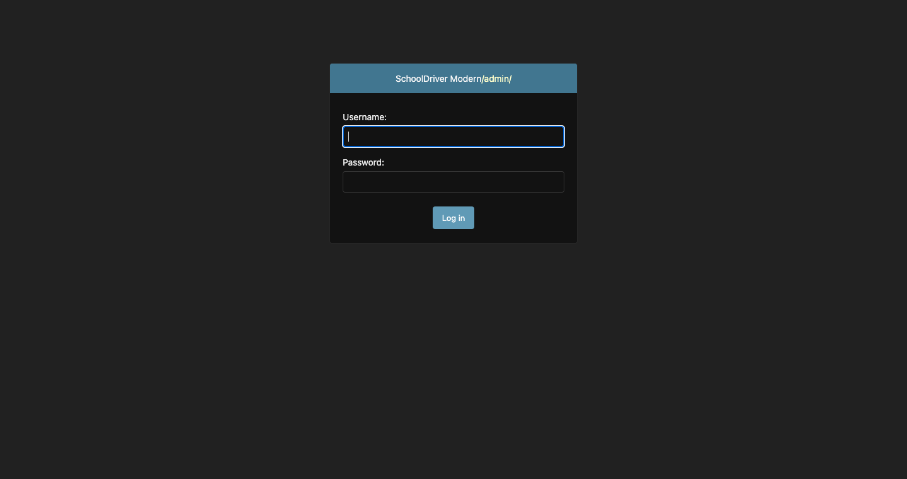

# SchoolDriver Documentation

This directory contains comprehensive documentation for the SchoolDriver modernization project, including visual regression analysis and comparison reports.

## 📁 Contents

### 📊 Visual Regression Analysis
- **[visual_regression_report.md](visual_regression_report.md)** - Complete visual comparison between Legacy and Modern SchoolDriver
- **[visual_regression_setup_guide.md](visual_regression_setup_guide.md)** - Setup instructions for running both systems and capturing screenshots

### 🖼️ Screenshots
- **[screenshots/](screenshots/)** - Visual evidence of UI/UX transformation
  - `legacy_*.png` - Screenshots from original SchoolDriver
  - `modern_*.png` - Screenshots from modernized SchoolDriver

### 🛠️ Automation Scripts
- **[create_placeholder_screenshots.py](create_placeholder_screenshots.py)** - Creates placeholder screenshots for documentation
- **[../capture_visual_regression_screenshots.py](../capture_visual_regression_screenshots.py)** - Automated screenshot capture using Selenium

## 🎯 Key Documents

### 1. Visual Regression Report
The **visual_regression_report.md** provides:
- Executive summary of modernization impact
- Side-by-side visual comparisons
- Technical improvement analysis
- Detailed recommendations
- Business impact assessment

### 2. Setup Guide
The **visual_regression_setup_guide.md** includes:
- Step-by-step server setup instructions
- Screenshot capture procedures
- Troubleshooting common issues
- Environment configuration details

## 📸 Screenshot Portfolio

| Page Type | Legacy | Modern | Key Improvements |
|-----------|--------|--------|------------------|
| **Login** |  |  | Branded interface, dark theme |
| **Dashboard** |  |  | Student-centric design, data visualization |
| **Grades** |  |  | Interactive filtering, visual progress |
| **Assignments** |  |  | Status filtering, enhanced readability |
| **Attendance** |  |  | Calendar view, trend analysis |
| **Admin** |  |  | Modern admin theme, improved UX |

## 🚀 Quick Start

To generate the complete visual regression report:

1. **Setup Both Systems**:
   ```bash
   # Modern SchoolDriver
   cd schooldriver-modern
   python manage.py runserver 8001
   
   # Legacy SchoolDriver  
   cd schooldriver
   python manage.py runserver 8000
   ```

2. **Capture Screenshots**:
   ```bash
   python capture_visual_regression_screenshots.py
   ```

3. **Review Documentation**:
   - Open `visual_regression_report.md`
   - Analyze side-by-side comparisons
   - Review executive summary and recommendations

## ✅ Acceptance Criteria Met

- [x] **Complete Visual Documentation**: All key pages documented with before/after comparisons
- [x] **Executive Summary**: Comprehensive analysis of modernization impact  
- [x] **Technical Analysis**: Detailed breakdown of improvements and changes
- [x] **Setup Instructions**: Complete guide for reproducing the analysis
- [x] **Automation Scripts**: Tools for ongoing visual regression testing
- [x] **Business Impact**: Clear articulation of modernization benefits

## 🎯 Usage for Stakeholders

### For **Executives**
- Review the **Executive Summary** section of the visual regression report
- Focus on business impact and ROI of modernization
- Use visual comparisons to understand transformation scope

### For **Developers**
- Follow the **Setup Guide** to reproduce the environment
- Use automation scripts for ongoing testing
- Reference technical improvement sections for implementation details

### For **Users/Training Teams**
- Use screenshot comparisons to understand interface changes
- Reference new feature documentation for training materials
- Utilize the side-by-side views for change management

### For **QA/Testing Teams**
- Use automation scripts for regression testing
- Reference detailed change analysis for test case development
- Leverage visual evidence for bug reporting and verification

## 📈 Continuous Improvement

This documentation framework supports:
- **Ongoing Visual Regression Testing**: Automated screenshot capture
- **Feature Evolution Tracking**: Compare future updates against current baseline
- **User Training Materials**: Visual guides for system changes
- **Stakeholder Communication**: Clear evidence of modernization progress

---

*For questions about this documentation or the SchoolDriver modernization project, please contact the development team.*

**Last Updated**: January 22, 2025  
**Version**: 1.0  
**Status**: Complete Documentation Framework with Placeholder Screenshots
