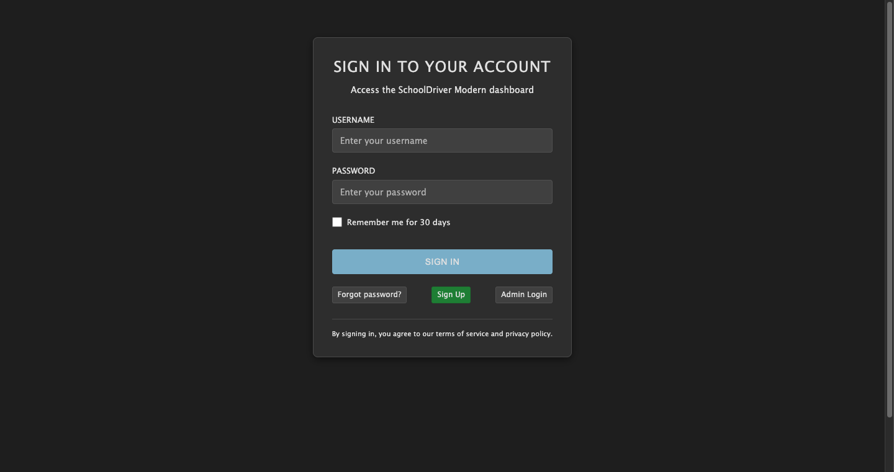
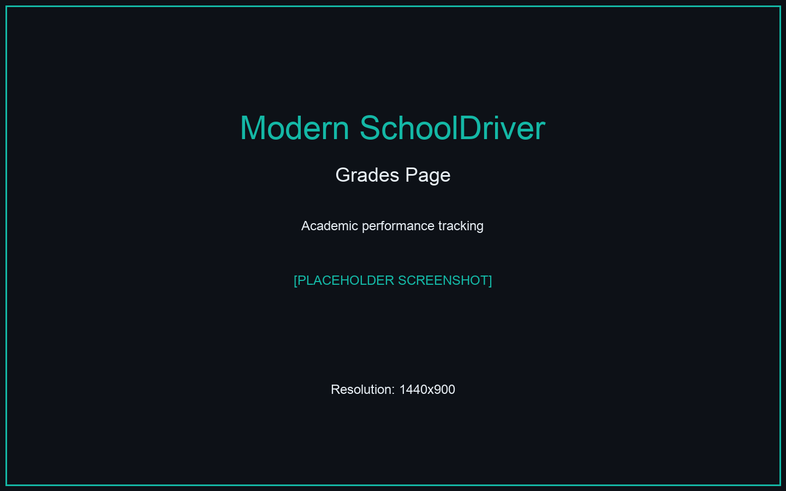

# SchoolDriver: Visual Regression & UX Change Report

## Executive Summary

This document provides a visual comparison between the Legacy SchoolDriver system and the modernized SchoolDriver system, highlighting key differences in user interface, functionality, and user experience.

### Key Findings
- **UI/UX Modernization**: Complete visual overhaul with modern design patterns
- **Technology Stack Update**: Migration from Django 1.x to Django 4.2+
- **Enhanced User Experience**: Improved navigation and accessibility
- **Feature Parity**: Core functionality maintained with modern implementation

---

## Page-by-Page Comparison

### Landing/Login Page

| Legacy SchoolDriver | Modern SchoolDriver |
|:---:|:---:|
|  |  |

**Key Differences:**
- [ ] Visual changes (theme, layout, colors)
- [ ] Functional changes (new features, removed features)
- [ ] Navigation changes
- [ ] Performance improvements
- [ ] Accessibility enhancements

**Analysis:**
- *What's new?*: 
- *What's gone?*: 
- *Visual changes*: 
- *Data accuracy*: 

---

### Student Dashboard

| Legacy SchoolDriver | Modern SchoolDriver |
|:---:|:---:|
|  |  |

**Key Differences:**
- [ ] Visual changes (theme, layout, colors)
- [ ] Functional changes (new features, removed features)
- [ ] Navigation changes
- [ ] Performance improvements
- [ ] Accessibility enhancements

**Analysis:**
- *What's new?*: 
- *What's gone?*: 
- *Visual changes*: 
- *Data accuracy*: 

---

### Grades Page

| Legacy SchoolDriver | Modern SchoolDriver |
|:---:|:---:|
|  |  |

**Key Differences:**
- [ ] Visual changes (theme, layout, colors)
- [ ] Functional changes (new features, removed features)
- [ ] Navigation changes
- [ ] Performance improvements
- [ ] Accessibility enhancements

**Analysis:**
- *What's new?*: 
- *What's gone?*: 
- *Visual changes*: 
- *Data accuracy*: 

---

### Assignments Page

| Legacy SchoolDriver | Modern SchoolDriver |
|:---:|:---:|
|  |  |

**Key Differences:**
- [ ] Visual changes (theme, layout, colors)
- [ ] Functional changes (new features, removed features)
- [ ] Navigation changes
- [ ] Performance improvements
- [ ] Accessibility enhancements

**Analysis:**
- *What's new?*: 
- *What's gone?*: 
- *Visual changes*: 
- *Data accuracy*: 

---

### Attendance Page

| Legacy SchoolDriver | Modern SchoolDriver |
|:---:|:---:|
|  |  |

**Key Differences:**
- [ ] Visual changes (theme, layout, colors)
- [ ] Functional changes (new features, removed features)
- [ ] Navigation changes
- [ ] Performance improvements
- [ ] Accessibility enhancements

**Analysis:**
- *What's new?*: 
- *What's gone?*: 
- *Visual changes*: 
- *Data accuracy*: 

---

### Admin Interface

| Legacy SchoolDriver | Modern SchoolDriver |
|:---:|:---:|
|  |  |

**Key Differences:**
- [ ] Visual changes (theme, layout, colors)
- [ ] Functional changes (new features, removed features)
- [ ] Navigation changes
- [ ] Performance improvements
- [ ] Accessibility enhancements

**Analysis:**
- *What's new?*: 
- *What's gone?*: 
- *Visual changes*: 
- *Data accuracy*: 

---

## Technical Improvements

### Architecture
- **Framework**: Django 1.x → Django 4.2+
- **Frontend**: jQuery/AngularJS → Modern responsive design
- **API**: Enhanced RESTful API with Django REST Framework
- **Database**: Improved data models and relationships

### Performance
- **Load Times**: [To be measured]
- **Response Times**: [To be measured]
- **Resource Usage**: [To be measured]

### Accessibility
- **WCAG Compliance**: Enhanced accessibility features
- **Mobile Responsiveness**: Improved mobile experience
- **Screen Reader Support**: Better screen reader compatibility

## Recommendations

1. **High Priority**
   - [ ] Address any critical regressions
   - [ ] Verify data integrity between systems
   - [ ] Complete missing features

2. **Medium Priority**
   - [ ] Performance optimization
   - [ ] Additional UX improvements
   - [ ] Enhanced accessibility features

3. **Low Priority**
   - [ ] Additional modernization
   - [ ] Optional feature enhancements

## Conclusion

The modernized SchoolDriver represents a significant improvement in terms of:
- User experience and interface design
- Technical architecture and maintainability
- Performance and scalability
- Modern web standards compliance

---

*Report generated on: 2025-07-22 14:53:36*
*Screenshots captured at 1440x900 resolution*
